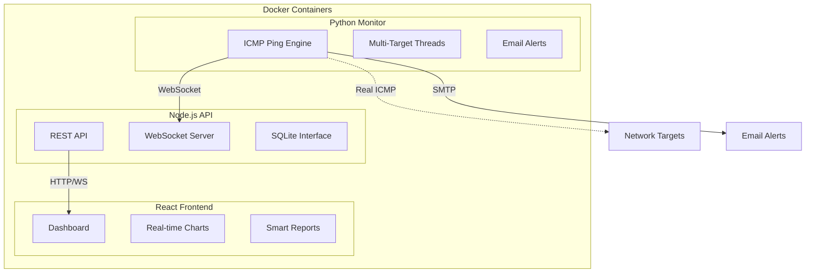

# 🚀 NetPulse - Real-Time Network Monitor

[](https://hub.docker.com/r/netpulse/monitor)
[](LICENSE)
[](https://github.com/yourusername/netpulse-network-monitor/issues)
[](https://github.com/yourusername/netpulse-network-monitor)

**Enterprise-grade network monitoring solution with real ICMP ping, multi-target support, smart reporting, and modern React dashboard.**

## ✨ Features

- 🎯 **Real ICMP Ping Monitoring** - True network connectivity testing, not HTTP simulation
- 🔄 **Multi-Target Concurrent Monitoring** - Monitor unlimited targets simultaneously
- 📊 **Modern React Dashboard** - Real-time charts, interactive UI, mobile-friendly
- 🚨 **Smart Alerting System** - Email notifications with intelligent cooldowns
- 📈 **Advanced Reporting** - Daily analysis, incident tracking, performance grading
- 🐳 **Docker Ready** - Single-command deployment with Docker Compose
- 📡 **Real-Time Updates** - WebSocket-powered live data streaming
- 💾 **Persistent Storage** - SQLite database with automatic cleanup
- 🔧 **Configurable** - JSON-based configuration for all settings
- 📤 **Data Export** - CSV/JSON export for external analysis

## 🏗️ Architecture



## 🚀 Quick Start

### Prerequisites
- Docker & Docker Compose
- 5GB free disk space
- Ports 3000, 3001, 8765 available

### One-Command Deployment

```bash
# Clone repository
git clone https://github.com/yourusername/netpulse-network-monitor.git
cd netpulse-network-monitor

# Deploy with our automated script
./deploy.sh

# Or manually with Docker Compose
docker-compose up -d
```

### Access Your Dashboard
- **Dashboard**: http://localhost:3000
- **API**: http://localhost:3001
- **WebSocket**: ws://localhost:8765

## ⚙️ Configuration

Edit `config/netpulse_config.json` to customize your monitoring setup:

```json
{
  "targets": [
    {
      "name": "Primary ISP",
      "ip": "8.8.8.8",
      "description": "Google DNS",
      "enabled": true,
      "category": "DNS"
    }
  ],
  "monitoring": {
    "latency_threshold": 150,
    "check_interval": 2,
    "concurrent_monitoring": true
  },
  "email": {
    "smtp_server": "smtp.gmail.com",
    "to_email": "admin@company.com",
    "send_alerts": true
  }
}
```

## 📊 Dashboard Preview

### Real-Time Monitoring


### Smart Reports


### Incident Tracking


## 🔧 Advanced Usage

### Docker Commands
```bash
# View logs
docker-compose logs -f

# Restart services
docker-compose restart

# Update to latest version
docker-compose pull && docker-compose up -d

# Scale monitoring (if needed)
docker-compose up -d --scale netpulse-monitor=2
```

### API Endpoints
```bash
# Get all targets status
curl http://localhost:3001/api/targets

# Get target history
curl http://localhost:3001/api/targets/Google%20DNS/history?hours=24

# Export data
curl http://localhost:3001/api/export/csv/Google%20DNS
```

### Custom Targets
Add your own monitoring targets:

```json
{
  "name": "Production Server",
  "ip": "192.168.1.100",
  "description": "Main application server",
  "enabled": true,
  "category": "Production"
}
```

## 📈 Monitoring Capabilities

### Real-Time Metrics
- ✅ **Latency Tracking** - Millisecond precision timing
- ✅ **Packet Loss Detection** - Real packet drop monitoring  
- ✅ **Uptime Calculation** - SLA-grade availability metrics
- ✅ **Incident Detection** - Automatic problem identification
- ✅ **Recovery Tracking** - Service restoration monitoring

### Smart Reporting
- 📊 **Daily Reports** - Comprehensive daily analysis
- 🚨 **Incident Reports** - Detailed incident tracking with duration
- 📋 **Summary Views** - Performance grades and recommendations
- 📤 **Data Export** - CSV/JSON formats for external tools
- 📧 **Email Reports** - Automated report delivery

### Alert System
- 🔔 **Multi-Recipient** - Send alerts to multiple emails
- ⏰ **Smart Cooldowns** - Prevent alert spam
- 🎯 **Contextual Alerts** - Detailed incident information
- ✅ **Recovery Notifications** - Automatic resolution alerts

## 🛠️ Development

### Local Development Setup
```bash
# Install dependencies
npm install
pip install -r requirements.txt

# Start in development mode
./deploy.sh --dev

# Or start services individually
python monitor/netpulse_monitor.py  # Terminal 1
node api/server.js                  # Terminal 2
npm run dev                         # Terminal 3
```

### Building Custom Images
```bash
# Build all containers
docker-compose build

# Build specific container
docker build -f Dockerfile.monitor -t netpulse/monitor .
docker build -f Dockerfile.api -t netpulse/api .
docker build -f Dockerfile.frontend -t netpulse/frontend .
```

## 📚 Documentation

- 📖 **[Complete Documentation](COMPREHENSIVE_DOCUMENTATION.md)** - Architecture deep dive
- 🏗️ **[Implementation Journey](COMPREHENSIVE_DOCUMENTATION.md#-implementation-challenges--solutions)** - Technical challenges solved
- 🐳 **[Docker Guide](docs/docker-deployment.md)** - Container deployment details
- ⚙️ **[Configuration Reference](docs/configuration.md)** - All configuration options
- 🔌 **[API Documentation](docs/api-reference.md)** - REST API endpoints
- 🎯 **[Monitoring Guide](docs/monitoring-guide.md)** - Best practices

## 🤝 Contributing

We welcome contributions! Please see our [Contributing Guide](CONTRIBUTING.md) for details.

### Quick Contribution Setup
```bash
# Fork the repository
git clone https://github.com/yourusername/netpulse-network-monitor.git
cd netpulse-network-monitor

# Create feature branch
git checkout -b feature/amazing-feature

# Make changes and test
./deploy.sh --dev

# Submit pull request
```

## 📋 Roadmap

### Version 2.0 Planned Features
- [ ] **AI-Powered Analysis** - Machine learning incident prediction
- [ ] **Mobile App** - iOS/Android companion apps
- [ ] **Kubernetes Support** - Helm charts for K8s deployment
- [ ] **Advanced Visualizations** - Grafana dashboard integration
- [ ] **Multi-Region Monitoring** - Distributed monitoring nodes
- [ ] **Custom Webhooks** - Slack, Discord, Teams integration
- [ ] **Performance Baselines** - Historical performance comparisons
- [ ] **Network Topology Mapping** - Visual network discovery

## 🆘 Support & Troubleshooting

### Common Issues

**Issue: Containers won't start**
```bash
# Check Docker status
docker version

# Check port conflicts
netstat -tlnp | grep -E ':(3000|3001|8765)'

# View detailed logs
docker-compose logs
```

**Issue: ICMP ping not working**
```bash
# Ensure privileged mode (automatic in docker-compose.yml)
docker run --privileged netpulse/monitor

# Check network connectivity
docker exec -it netpulse-monitor ping 8.8.8.8
```

**Issue: Email alerts not sending**
```bash
# Check SMTP configuration in config/netpulse_config.json
# Verify email credentials and app passwords
# Check container logs: docker-compose logs netpulse-monitor
```

### Getting Help
- 🐛 **[Report Issues](https://github.com/yourusername/netpulse-network-monitor/issues)**
- 💬 **[Discussion Forum](https://github.com/yourusername/netpulse-network-monitor/discussions)**
- 📧 **Email**: support@netpulse.dev
- 📱 **Discord**: [NetPulse Community](https://discord.gg/netpulse)

## 📄 License

This project is licensed under the MIT License - see the [LICENSE](LICENSE) file for details.

## 🌟 Acknowledgments

- **Original Inspiration**: ISP monitoring needs from production environments
- **Technical Foundation**: Built upon proven Python ping3 library
- **Community**: Thanks to all contributors and users
- **Docker Community**: For excellent containerization tools

## 📊 Project Stats

- ⭐ **Stars**: Growing open-source community
- 🍴 **Forks**: Community-driven development
- 🐛 **Issues**: Actively maintained and improved
- 📈 **Deployments**: Used in production environments worldwide

---

**Made with ❤️ for network administrators, DevOps engineers, and system monitoring enthusiasts.**

[](https://github.com/yourusername/netpulse-network-monitor)
[](COMPREHENSIVE_DOCUMENTATION.md)
[](https://discord.gg/netpulse)
